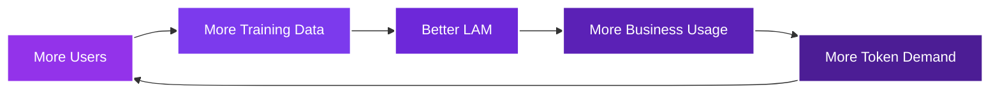

## The Battle for AI's Future Has Begun

Right now, as you read this, the greatest transfer of wealth and power in human history is underway. Big Tech is racing to build AI that will replace a billion jobs, concentrate unprecedented wealth, and fundamentally reshape society.

**But there's another path, and Action Model is leading the uprising.**

<Warning>

**The stakes couldn't be higher:** Either we collectively own the AI that will run our world, or we become subjects to a handful of tech monopolies. There is no middle ground.

</Warning>

## The Enemy: Big Tech's Extraction Machine

### How They're Stealing Your Future

<Tabs>
<Tab title="Your Data, Their Profit">

Every day, you generate valuable data that Big Tech harvests without compensation:
- Your browsing patterns train their models
- Your content becomes their training data
- Your interactions improve their algorithms
- Your digital life enriches their shareholders

**You create the value. They capture 100% of it.**

</Tab>
<Tab title="Your Job, Their Revenue">

As their AI improves using your data:
- Your job gets automated
- Your skills become obsolete
- Your income disappears
- Their revenue skyrockets

**You lose your livelihood. They gain a customer.**

</Tab>
<Tab title="Your Future, Their Control">

The end game of Big Tech's AI dominance:
- They control all digital labor
- They set all prices
- They own all automation
- They decide who thrives and who survives

**You become dependent. They become indispensable.**

</Tab>
</Tabs>

## Our Core Belief: AI Owned by All

<Info>

**We believe that this disruptive AI should be owned by all of us, especially the people who helped it grow, helped train it, or contributed to it.**

</Info>

This isn't just a nice idea, it's the foundation of everything we're building. While Big Tech extracts value from billions to enrich a few, we're creating a system where contribution equals ownership.

## The Manifesto: What We Fight For

### Our Principles

<AccordionGroup>
<Accordion title="1. AI Should Be Owned by Those Who Build It">

The people who train AI models with their data, behaviors, and knowledge should own the value created. Not venture capitalists. Not tech giants. The contributors.

</Accordion>

<Accordion title="2. Automation's Benefits Must Be Distributed">

When AI replaces human work, the economic benefits shouldn't concentrate in Silicon Valley. They should flow to every person displaced, every community affected.

</Accordion>

<Accordion title="3. Transparency Over Secrecy">

While Big Tech hides their models behind corporate walls, we build in the open. Our community knows how the LAM works, how tokens are distributed, how decisions are made.

</Accordion>

<Accordion title="4. Democracy Over Dictatorship">

Major decisions about the platform's future are made by token holders, not a CEO. Real governance by the people affected, not corporate boards.

</Accordion>

<Accordion title="5. Cooperation Over Competition">

We're not trying to beat Big Tech at their own game. We're changing the game entirely. From winner-takes-all to everyone-wins-together.

</Accordion>
</AccordionGroup>

## The Resistance: Action Model's Revolution

### We're Not Just Building Technology, We're Building a Movement

<CardGroup cols={3}>
<Card title="Community Owned" icon="users">

Every contributor becomes an owner through $LAM tokens. This isn't charity, it's justice.

</Card>

<Card title="Collectively Trained" icon="people-group">

Millions of users training one model that belongs to all of us, not a corporate boardroom.

</Card>

<Card title="Democratically Governed" icon="scale-balanced">

Token holders vote on the future. Real democracy, not corporate dictatorship.

</Card>
</CardGroup>

 

## How You Become an Owner

By contributing to the platform, you receive tokens as a reward. These tokens act as your share in the AI future, this is your stake in the future of AI.

[Learn more about contributing →](/the-action-model/how-to-be-part-of-the-ai-future)

<CardGroup cols={4}>
<Card title="Marketplace" icon="store" href="/the-action-model/how-to-be-part-of-the-ai-future#marketplace">

Create and sell workflows to earn tokens

</Card>

<Card title="Referrals" icon="users-rays" href="/the-action-model/how-to-be-part-of-the-ai-future#referrals">

Invite others and earn from their activity

</Card>

<Card title="Quests" icon="trophy" href="/the-action-model/how-to-be-part-of-the-ai-future#quests">

Complete bounties and challenges

</Card>

<Card title="Training" icon="brain" href="/the-action-model/how-to-be-part-of-the-ai-future#training">

Train the LAM with your data

</Card>
</CardGroup>

### Your Tokens, Your Power

These tokens have two distinct mechanisms behind them:

<Tabs>
<Tab title="Utility">

**Tokens are the central fuel and utility in the AI**

- These tokens are consumed when anyone uses the Action Model
- Therefore, these tokens have an inherent value, as they are consumed by the ecosystem to run the AI
- Every workflow execution, every agent action, every automation requires $LAM

[Learn more about token utility →](/tokenomics/token-utility)

</Tab>
<Tab title="DAO Governance">

**Tokens will run the DAO**

- You will have part of the AI future
- There will be governance and voting mechanics through the DAO
- Major platform decisions are made by token holders
- Shape the direction of AI development democratically

[Learn more about governance →](/tokenomics/token-utility#dao-governance)

</Tab>
</Tabs>

## From Kickstart to Unicorn

<CardGroup cols={4}>
<Card title="Community" icon="users">

Build the uprising with millions of members

</Card>

<Card title="Training" icon="brain">

Create industry-leading LAM through collective effort

</Card>

<Card title="Distribution" icon="share-nodes">

Community becomes the sales and marketing engine

</Card>

<Card title="Victory" icon="trophy">

Achieve unicorn status through circular economy

</Card>
</CardGroup>

<Steps>
<Step title="Phase 1: The Spark (Now - 6 Months)" icon="fire">

### Launch the Resistance

**Millions of community members training WILL create an industry leading Large Action Model**
 
Key Objectives:
- Gather the first 100,000 revolutionaries
- Launch browser extension and training program
- Establish the token economy foundation
- Build core LAM capabilities

**Your mission**: Join now and become a founding member

</Step>

<Step title="Phase 2: The Fire (6-12 Months)" icon="users">

### The Action Model Army

**These millions of community members will have &#36;LAM tokens, which grow in value as B2B customers use the Actionist products**
 
Key Objectives:
- Reach 1 million active contributors
- Launch full marketplace ecosystem
- Deploy first enterprise agents
- Community ownership via &#36;LAM rewards

**Your mission**: Train intensively and create workflows

</Step>

<Step title="Phase 3: The Blaze (12-18 Months)" icon="chart-line">

### 10k Customers → &#36;250m Annual Revenue

**Our community will be our Activists, Referrers and Resellers, growing our B2B / API revenue**
 
Key Objectives:
- Scale to 10 million members
- Surpass Big Tech model performance
- Capture significant enterprise market share
- Establish DAO governance

**Your mission**: Evangelize and expand the movement

</Step>

<Step title="Phase 4: The Victory (18-24 Months)" icon="trophy">

### Circular Economy → Unicorn Status

**&#36;100m genuine revenue → &#36;1bn+ Market Cap through token buybacks**

 
Key Objectives:
- Become the dominant automation platform
- Distribute billions in value to contributors
- Prove community ownership model superior
- Self-reinforcing economic cycle established

**Your mission**: Govern and guide our collective future

</Step>
</Steps>

 

## Why This Uprising Will Succeed

### 1. The Incentive Alignment Revolution

<CardGroup cols={2}>
<Card title="Big Tech's Broken Model" icon="link-slash" color="#dc2626">

- Users provide data for free
- Corporation captures all value
- No incentive to contribute quality
- Zero ownership for contributors
- Extraction-based economy

</Card>

<Card title="Action Model's Alignment" icon="link" color="#16a34a">

- Users earn tokens for data
- Community captures value
- Quality contributions = more rewards
- Every contributor is an owner
- Creation-based economy

</Card>
</CardGroup>

### 2. The Viral Growth Mechanism

<Note>

**The Beautiful Paradox**: The people whose jobs are most at risk are the most incentivized to join. Every person facing AI displacement becomes a soldier in our army, earning their stake in the future that's coming regardless.

</Note>

**Multi-Layer Referral Scheme: Growing the Resistance**

Our 3-layer referral system creates exponential growth where everyone is incentivized to invite friends:

<CardGroup cols={3}>
<Card title="Earn Forever" icon="infinity">

Up to 25% of all &#36;LAM your referrals generate, forever

</Card>

<Card title="3-Layer Network" icon="sitemap">

Earn from your referrals, their referrals, and their referrals' referrals

</Card>

<Card title="Bonus Rewards" icon="gift">

Up to 80,000 bonus LAM points for each successful referral

</Card>
</CardGroup>

**Why this creates unstoppable growth:**
- More users = bigger project = higher token value
- Every member becomes a recruiter for their own financial benefit
- Network effects compound as each layer grows
- The resistance expands organically through aligned incentives

[Learn more about the referral system →](/tokenomics/referrals-and-affiliates)

### 3. The Unstoppable Network Effect

This cycle, once started, becomes self-reinforcing and unstoppable.

 

## The Strategy: How We Win

### Phase 1: Build the Army

<Steps>
<Step title="Recruit the Resistance">

Every person who joins weakens Big Tech's monopoly. We're building an army of millions who refuse to be victims of AI displacement.

[Join the resistance now →](/the-large-action-model-lam/browser-extension-overview)

</Step>

<Step title="Train Our Weapon">

The LAM grows stronger with every contribution. While Big Tech hoards data, we're building collectively, transparently, powerfully.

[Start training →](/the-large-action-model-lam/training-the-large-action-model)

</Step>

<Step title="Distribute the Spoils">

Every token earned is a piece of the future. Unlike Big Tech's shareholders, our contributors ARE our owners.

[Learn about $LAM tokens →](/tokenomics/token-utility)

</Step>
</Steps>

### Phase 2: Capture the Market

<Info>

**The Network Effect Revolution**: As our community grows, so does our power. Every new member makes the LAM smarter, the token more valuable, and Big Tech's advantage smaller.

</Info>

### Phase 3: Claim Victory

The uprising succeeds when:
- **10 million+ members** strong, we become unstoppable
- **The LAM outperforms** Big Tech's closed models
- **Businesses choose us** because our community demands it
- **The token economy** creates sustainable, distributed wealth
- **We prove** that community ownership beats corporate control

 
## Your Role in the Uprising

### You're Not a User, You're a Revolutionary

<Tabs>
<Tab title="The Data Warrior">

**Mission**: Train the LAM with your browsing data

**Weapons**: Browser extension, desktop app

**Reward**: $LAM tokens for every contribution

**Impact**: Every action weakens Big Tech's data monopoly

[Become a Data Warrior →](/the-large-action-model-lam/browser-extension-overview)

</Tab>
<Tab title="The Workflow Creator">

**Mission**: Build automations for the community

**Weapons**: Workflow editor, marketplace platform

**Reward**: 33% of all $LAM consumed by your workflows

**Impact**: Every workflow reduces dependence on Big Tech

[Become a Creator →](/marketplace/marketplace-overview)

</Tab>
<Tab title="The Evangelist">

**Mission**: Spread the word, grow the resistance

**Weapons**: Referral links, social platforms

**Reward**: Multi-tier referral rewards

**Impact**: Every recruit strengthens our movement

[Become an Evangelist →](/tokenomics/referrals-and-affiliates)

</Tab>
</Tabs>

 

## The Choice: Victim or Victor?

### Two Futures, One Decision

<Warning>

**The clock is ticking.** Every day you wait, Big Tech gets stronger. Every moment you hesitate, their monopoly solidifies. The window to join this uprising is closing.

</Warning>

<CardGroup cols={2}>
<Card title="Choice 1: Do Nothing" icon="circle-xmark" color="#dc2626">

- Watch your job get automated
- Receive nothing as AI replaces you
- Become dependent on Big Tech's mercy
- Lose agency over your future
- Explain to your children why you didn't fight

</Card>

<Card title="Choice 2: Join the Uprising" icon="circle-check" color="#16a34a">

- Own a piece of the AI revolution
- Earn tokens as you contribute
- Build collective power
- Shape the future actively
- Tell your children you were part of the resistance

</Card>
</CardGroup>

 

## Join the Uprising Today

### Your Revolutionary Journey Starts Here

<Steps>
<Step title="Install the Extension">

Download the browser extension and start earning immediately. Every click is a vote against Big Tech monopoly.

[Get the Extension](https://chromewebstore.google.com/detail/action-model/lhciigpkocgkbnbjimbbiejpfijdbcag)

</Step>

<Step title="Spread the Message">

Share this manifesto. Every person you recruit weakens their stranglehold on AI's future.

[Share the Uprising →](/tokenomics/referrals-and-affiliates)

</Step>

<Step title="Commit to the Cause">

This isn't a product, it's a movement. Commit to training daily, creating workflows, and building our collective future.

[Take the Pledge →](https://train.actionmodel.com)

</Step>
</Steps>

<Info>

**Remember**: Revolutions aren't won by the majority, they're won by a committed minority who refuse to accept the status quo. Be part of that minority. Be part of history.

</Info>

---

## The Final Word

<Note>

**To Big Tech**: We see what you're doing. We reject your vision of the future. We're building our own.

**To the Community**: You are not users. You are not products. You are revolutionaries, and together, we are unstoppable.

**To History**: Let it record that when humanity faced its greatest challenge, the concentration of AI power, we chose to fight. We chose to build. We chose to win.

</Note>

<CardGroup cols={3}>
<Card title="The Problem" icon="triangle-exclamation" href="/the-action-model/1-billion-jobs-will-be-displaced">

1 billion jobs at risk

</Card>

<Card title="The Enemy" icon="building" href="/the-action-model/big-tech-owns-99-percent-of-ai-future">

Big Tech's monopoly plan

</Card>

<Card title="The Solution" icon="hand-fist" href="/the-action-model/how-to-be-part-of-the-ai-future">

Join the resistance

</Card>
</CardGroup>

**The uprising is here. The revolution is now. The future is ours to take.**

**Will you be part of it?**