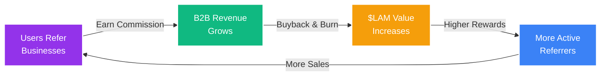
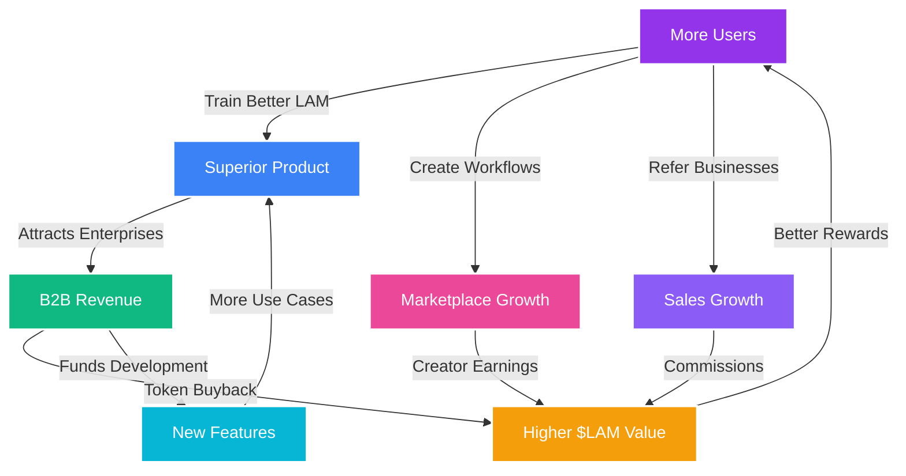

<Warning>

**The AI Automation Gold Rush Has Begun**: We're not building for one market—we're positioned to capture value across a dozen trillion-dollar industries. Every revenue stream drives &#36;LAM buyback and burn, creating unprecedented token appreciation potential.

</Warning>

## The Perfect Storm of Opportunity

### Why Action Model Will Dominate

The convergence of AI capabilities, market demand, and our unique positioning creates an unprecedented opportunity. Unlike single-purpose platforms, Action Model captures value at every layer of the AI automation stack—from raw data to enterprise deployments.

<CardGroup cols={3}>
<Card title="&#36;4.7 Trillion" icon="chart-line">

Global AI market size by 2030, with automation representing the largest segment

</Card>

<Card title="10+ Revenue Streams" icon="coins">

Diversified income sources all driving &#36;LAM token demand through buyback mechanisms

</Card>

<Card title="First-Mover Advantage" icon="trophy">

The only community-owned LAM with millions of users training the model

</Card>
</CardGroup>

## Data Value

### The New Oil of AI

<Check>

**Proprietary Moat**: Unlike LLM training data that's freely scraped from the internet, LAM training data requires real human-computer interactions. Our community provides this exclusively, creating an insurmountable competitive advantage.

</Check>

The Action Model dataset represents millions of hours of human GUI interactions that cannot be replicated, scraped, or synthesized. This data is the foundation of accurate action prediction and execution.

**Market Opportunity**:
- **Data Licensing**: Enterprises pay millions for quality training data
- **Model Superiority**: Better data = better LAM = higher enterprise adoption
- **Defensible Position**: Competitors cannot access our proprietary dataset
- **Network Effects**: More users → better data → better product → more users

<Info>

**Valuation Comparison**: OpenAI's valuation is largely based on their model quality, which stems from data. Our community-generated dataset could be worth billions as the foundation of LAM technology.

</Info>

## Extension Value

### Monetizing the User Base

### Multiple Revenue Streams from Extension Users

Having millions of users with our extension installed creates multiple monetization opportunities beyond LAM training:

<Tabs>
<Tab title="DePIN Network" icon="network-wired">

### Decentralized Physical Infrastructure

**Market Size**: &#36;3.5 trillion cloud computing market

Leveraging users' distributed computing resources through the Action Model desktop app to create a decentralized physical infrastructure network:

- **Compute Marketplace**: Sell aggregated processing power to enterprises
- **Storage Network**: Distributed storage competing with AWS S3
- **GPU Sharing**: ML training compute at 70% lower cost than centralized providers
- **Edge Computing**: Low-latency processing closer to end users

**Revenue Potential**: &#36;50-100 per user per month in compute credits

</Tab>
<Tab title="Distributed Computing" icon="server">

### Global Compute Marketplace

**Market Size**: &#36;500 billion HPC market

Creating the world's largest distributed supercomputer:

- **AI Training**: Rent compute for model training at scale
- **Batch Processing**: Enterprise data processing jobs
- **Rendering Farms**: CGI and video rendering services
- **Scientific Computing**: Research institutions needing massive compute

**Revenue Model**: 30% commission on all compute transactions

</Tab>
<Tab title="Proxy Network" icon="globe">

### Residential IP Monetization

**Market Size**: &#36;15 billion proxy services market

Similar to Grass.io's successful model:

- **Web Scraping**: Clean residential IPs for data collection
- **Ad Verification**: Check global ad placements
- **SEO Monitoring**: Track search rankings worldwide
- **Market Research**: Price comparison and competitive intelligence

**User Earnings**: &#36;5-50 per month passive income
**Platform Revenue**: 40% of proxy usage fees

</Tab>
</Tabs>

## Large Action Model Value

### The Core Product Advantage

<Note>

**Unique Position**: We're not just building another AI—we're creating the only community-trained LAM with real-world data from millions of users. This positions us to capture the enterprise automation market.

</Note>

### Revenue Channels

<CardGroup cols={3}>
<Card title="Desktop App" icon="desktop">

**B2B SaaS Model**
- &#36;1,000-2,000/month per agent
- Unlimited actions included
- 24/7 autonomous operation
- Target: 500K agents by 2027

</Card>

<Card title="Cloud Infrastructure" icon="cloud">

**Enterprise Deployments**
- Custom VPC environments
- Scalable agent fleets
- SOC2 compliance
- &#36;10K-100K/month contracts

</Card>

<Card title="API Platform" icon="code">

**Developer Ecosystem**
- Pay-per-action model
- &#36;0.001-0.01 per API call
- Millions of daily calls
- Powers third-party apps

</Card>
</CardGroup>

## B2B Distribution Network

### Community as Salesforce

<Check>

**Revolutionary Model**: Transform millions of users into a distributed B2B salesforce. Every user becomes a revenue generator, earning commissions while driving &#36;LAM token value through the buyback mechanism.

</Check>

### The Flywheel Effect

**Commission Structure**:
- **Direct Sales**: 20-30% first-year commission
- **Recurring Revenue**: 5-10% lifetime share
- **Monthly Earnings**: &#36;100-500 per referred customer
- **Token Appreciation**: Additional value from $LAM holdings

[Learn more about referral rewards →](/tokenomics/referrals-and-affiliates)

## Management Consultancy

### The Salesforce Playbook

<Info>

**Proven Model**: Salesforce's ecosystem includes 3,000+ consulting partners generating &#36;6 in services for every &#36;1 of license revenue. Action Model can replicate this high-margin opportunity.

</Info>

### Partner Ecosystem Structure

<Tabs>
<Tab title="Partner Network" icon="handshake">

**Certified Implementation Partners**:
- **Platinum Partners**: &#36;10M+ annual implementations
- **Gold Partners**: &#36;1M-10M implementations  
- **Silver Partners**: &#36;100K-1M implementations
- **Registered Partners**: Entry-level certification

**Revenue Share**: 20-40% of implementation fees

</Tab>
<Tab title="Internal Consultancy" icon="building">

**Action Model Professional Services**:
- **Enterprise Onboarding**: &#36;50K-500K projects
- **Custom Workflow Development**: &#36;10K-100K
- **Training & Certification**: &#36;5K per person
- **Ongoing Support**: &#36;10K-50K/month retainers

**Margin**: 70-80% gross profit

</Tab>
<Tab title="Certification Program" icon="graduation-cap">

**Education & Training**:
- **Individual Certification**: &#36;500-2,000 per person
- **Corporate Training**: &#36;10K-50K per company
- **Annual Renewals**: &#36;200-500 recurring
- **Specialized Tracks**: Industry-specific expertise

**Market Size**: 100K+ certified professionals by 2027

</Tab>
</Tabs>

## Workflow & Agent Marketplace

### The App Store for Automation

<Warning>

**Massive Opportunity**: Zapier's template marketplace drives 30% of their $140M ARR. Our marketplace for complex GUI automations could be 10x larger.

</Warning>

### Marketplace Economics

<CardGroup cols={2}>
<Card title="Transaction Model" icon="arrow-right-arrow-left">

**Revenue Streams**:
- 30% commission on all sales
- Featured placement fees
- Premium vendor accounts
- Certification programs

**Average Transaction**: $50-500

</Card>

<Card title="Creator Economy" icon="paintbrush">

**Creator Incentives**:
- 70% revenue share
- $10K+ monthly top earners
- Bounty programs
- Recognition & rewards

**Active Creators**: 10K+ by 2026

</Card>
</CardGroup>

### Custom Development Market

- **Bespoke Workflows**: $500-10,000 per project
- **Enterprise Automations**: $10K-100K implementations
- **Maintenance Contracts**: $1K-10K monthly recurring
- **Market Size**: $2B+ by 2027

[Explore marketplace opportunities →](/tokenomics/marketplace-distributions)

## API Platform

### Powering the Developer Ecosystem

<Note>

**OpenAI Model**: OpenAI generates $2B+ annually from API access. Action Model's LAM API could capture similar value in the automation space.

</Note>

### API Revenue Streams

<AccordionGroup>
<Accordion title="Action Prediction API">

**Query Next Action Service**:
- Developers send screen state and context
- Receive AI-predicted next actions
- Enable automation in any application
- **Pricing**: $0.001-0.01 per call
- **Volume**: Billions of monthly calls

</Accordion>

<Accordion title="VPC Provisioning API">

**Enterprise Agent Deployment**:
- Programmatically spin up isolated agents
- Secure cloud environments
- Scalable infrastructure
- **Pricing**: $0.10-1.00 per hour
- **Market**: Enterprise DevOps teams

</Accordion>

<Accordion title="Workflow Execution API">

**Run Complex Automations**:
- Execute pre-built workflows via API
- Chain multiple actions
- Handle conditional logic
- **Pricing**: $0.01-0.10 per workflow
- **Use Cases**: SaaS integrations

</Accordion>
</AccordionGroup>

## Industry Partnerships

### Vertical Market Domination

### Target Industries for Action Model Deployment

### $100B+ Addressable Markets

<Tabs>
<Tab title="Call Centers" icon="headset">

**Market Size**: $340B globally

**Opportunity**: Replace 60-80% of human agents
- **Cost Savings**: $100K+ per agent annually
- **Partners**: Concentrix, Teleperformance, Sykes
- **Revenue Model**: Per-seat licensing
- **Potential**: 10M agents × $1K/month = $120B annual

</Tab>
<Tab title="Financial Services" icon="landmark">

**Market Size**: $22T industry

**Applications**:
- KYC/AML compliance automation
- Loan processing (90% faster)
- Account opening procedures
- Trading operations support

**Revenue Opportunity**: $10B+ annually

</Tab>
<Tab title="Healthcare Admin" icon="hospital">

**Market Size**: $1T in admin costs

**Impact**: Reduce 30% of healthcare costs
- EMR system navigation
- Insurance claim processing
- Appointment scheduling
- Patient record management

**Savings Potential**: $300B annually

</Tab>
<Tab title="E-commerce Ops" icon="shopping-cart">

**Market Size**: $6T global sales

**Automation Targets**:
- Product listing management
- Inventory synchronization
- Order processing
- Customer service

**Platform Partners**: Shopify, Amazon, eBay

</Tab>
</Tabs>

### Additional Verticals

<CardGroup cols={3}>
<Card title="Accounting Firms" icon="calculator">

10x productivity gains in bookkeeping and tax preparation

</Card>

<Card title="Legal Services" icon="gavel">

Document review and contract analysis at machine speed

</Card>

<Card title="Real Estate" icon="home">

MLS management and lead follow-up automation

</Card>

<Card title="HR & Recruitment" icon="users">

Resume screening and onboarding at scale

</Card>

<Card title="Digital Marketing" icon="bullhorn">

Campaign management across all platforms

</Card>

<Card title="SaaS Support" icon="life-ring">

First-line ticket triage and resolution

</Card>
</CardGroup>

## Agent Infrastructure Value

### The Cursor.io Phenomenon

<Check>

**Fastest to $100M ARR**: Cursor reached this milestone faster than any company in history—not by building AI, but by creating the best infrastructure around it. Action Model's agent infrastructure represents similar potential.

</Check>

### Infrastructure Components

<Tabs>
<Tab title="Core Architecture" icon="sitemap">

**Proprietary Systems**:
- **Workflows**: Sequential action chains
- **Branches**: Conditional logic handling
- **Loops**: Iterative processing
- **Memories**: Contextual state management
- **Relations**: Entity relationship mapping

**Value**: Infrastructure alone has significant value

</Tab>
<Tab title="Background Onboarding" icon="eye">

**Revolutionary Approach**:
- AI observes user actions for 30 days
- Automatically builds agent configuration
- No manual setup required
- 99% of businesses will use this

**Pricing**: Onboarding fee per agent

</Tab>
<Tab title="Action History" icon="database">

**Intelligent Memory System**:
- Tracks all previous actions
- Prevents duplicate operations
- Maintains state across sessions
- Enables complex workflows

**Competitive Advantage**: Years ahead of competitors

</Tab>
</Tabs>

## Lock-In Strategy

### Building an Unassailable Moat

<Warning>

**The CRM Lesson**: Salesforce and HubSpot aren't technically superior—they're sticky. Once implemented, switching costs make customers permanent. Action Model agents will be 10x stickier.

</Warning>

### Creating Switching Barriers

<Steps>
<Step title="Complex Configuration Lock-In">

Workflows, chains, variables, relations, branches, loops, schedules—all custom-configured for each business, making migration nearly impossible.

</Step>

<Step title="Data Accumulation">

Months of operational history, learned patterns, and optimizations that cannot be exported or replicated.

</Step>

<Step title="Process Dependency">

Businesses rebuild their operations around agents, making them mission-critical infrastructure.

</Step>

<Step title="Relationship Lock">

Deep integrations with existing tools and systems create a web of dependencies.

</Step>

<Step title="Pricing Strategy">

Like HubSpot's 90% initial discount, we'll acquire aggressively then monetize the installed base.

</Step>
</Steps>

### Customer Lifetime Value

- **Average Contract Value**: $15K annually
- **Churn Rate**: &lt;5% after year 1
- **Customer Lifetime**: 10+ years
- **CLV**: $150K+ per customer

## Network Effects Amplification

### How Everything Compounds

## Revenue Projections

### Path to $10B Valuation

<Tabs>
<Tab title="Year 1-2" icon="seedling">

**Building Foundation**:
- 1M+ active users
- 1,000 enterprise customers
- $10M ARR
- Token price: $0.10-0.50

**Focus**: User acquisition and product development

</Tab>
<Tab title="Year 3-4" icon="chart-line">

**Scaling Revenue**:
- 10M+ active users
- 10,000 enterprises
- $250M ARR
- Token price: $1-10

**Focus**: Enterprise expansion and marketplace growth

</Tab>
<Tab title="Year 5+" icon="rocket">

**Market Domination**:
- 50M+ active users
- 100,000 enterprises
- $2B+ ARR
- Token price: $10-100

**Focus**: Global expansion and vertical integration

</Tab>
</Tabs>

## Why This Works

### The Perfect Business Model

<CardGroup cols={2}>
<Card title="Diverse Revenue" icon="coins">

10+ uncorrelated revenue streams reduce risk and maximize opportunity

</Card>

<Card title="Token Flywheel" icon="arrows-rotate">

Every revenue source drives token demand through buyback mechanisms

</Card>

<Card title="Network Effects" icon="share-nodes">

Each user makes the product better and more valuable

</Card>

<Card title="First Mover" icon="flag">

Years ahead in community, data, and technology

</Card>

<Card title="Lock-In Model" icon="lock">

High switching costs create permanent customers

</Card>

<Card title="Infinite Scale" icon="infinity">

Software margins with global reach

</Card>
</CardGroup>

## Competitive Advantages

### Why We Win

<AccordionGroup>
<Accordion title="Proprietary Data Moat">

Millions of users providing exclusive training data that competitors cannot access or replicate.

</Accordion>

<Accordion title="Community Distribution">

Built-in salesforce of millions driving B2B adoption without traditional sales costs.

</Accordion>

<Accordion title="Token Economics">

Aligned incentives where everyone benefits from platform growth.

</Accordion>

<Accordion title="Technical Innovation">

First true LAM with GUI understanding, not just API connectors.

</Accordion>

<Accordion title="Ecosystem Approach">

Platform strategy capturing value at every layer.

</Accordion>
</AccordionGroup>

## The Opportunity is Now

<Warning>

**Critical Timing**: The AI automation revolution is happening NOW. Early movers will capture trillion-dollar markets. Late entrants will fight for scraps.

</Warning>

### Call to Action

The convergence of AI capabilities, market demand, and our unique positioning creates a once-in-a-generation opportunity. Action Model isn't just another AI company—it's positioned to become the operating system for business automation.

<CardGroup cols={3}>
<Card title="Join the Revolution" icon="users" href="/the-large-action-model-lam/browser-extension-overview" color="#9333ea">

Start training the LAM and earning your stake

</Card>

<Card title="Explore Token Utility" icon="coins" href="/tokenomics/token-utility" color="#3b82f6">

Learn how $LAM captures all this value

</Card>

<Card title="View Economics" icon="chart-line" href="/tokenomics/token-economics" color="#10b981">

Understand the complete economic model

</Card>
</CardGroup>

---

**We're not building a product. We're building an economy.**

**Every market is an opportunity. Every user is an owner. Every action drives value.**

**The question isn't if Action Model will succeed—it's how much of the opportunity you'll capture.**