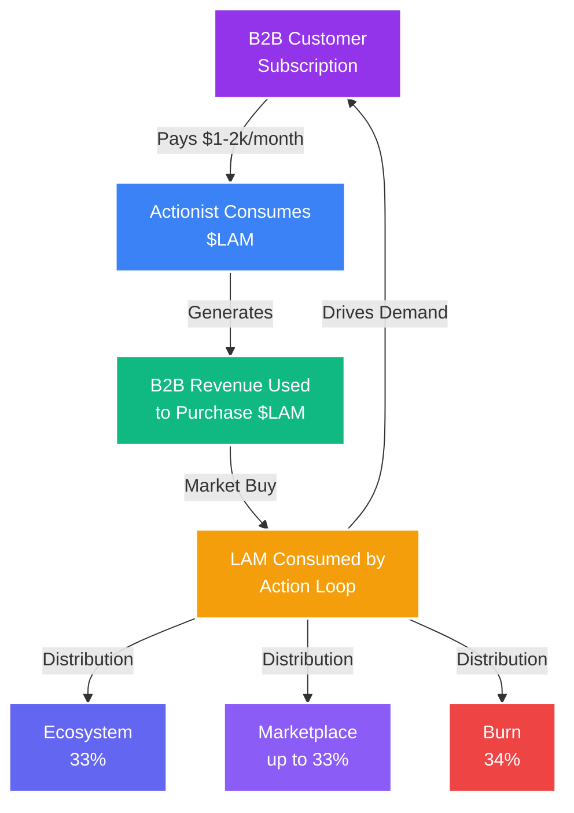

<Note>

**The Perfect Economic Storm**: $LAM combines the deflationary power of burning, the growth velocity of network effects, and the value creation of real B2B revenue. This isn't speculation—it's an economic revolution backed by actual utility.

</Note>

## The $LAM Economic Model

### A New Paradigm for AI Ownership

The $LAM token represents more than cryptocurrency—it's the foundation of a new economic system where AI value flows to the community that creates it, not corporate shareholders. Every aspect is designed to create sustainable, long-term value appreciation.

<CardGroup cols={3}>
<Card title="Deflationary by Design" icon="fire">

34% of every token used is burned forever, creating permanent scarcity

</Card>

<Card title="Revenue-Backed" icon="building">

B2B subscriptions create continuous buy pressure through the buyback mechanism

</Card>

<Card title="Community-Driven" icon="users">

35% of supply distributed to trainers, creators, and network builders

</Card>
</CardGroup>

## Token Distribution

### Initial Supply Allocation

<Frame caption="Token Distribution - Building a Sustainable Ecosystem">
  
</Frame>

### Total Supply: 1,000,000,000 $LAM

<Tabs>
<Tab title="Community (35%)" icon="users">

### 350,000,000 tokens

**Distribution Schedule**:
- 4-year vesting period
- Daily distributions based on contributions
- No cliff, immediate earning starts

**Allocation Breakdown**:
- Training rewards: 200M (20%)
- Referral bonuses: 75M (7.5%)
- Creator incentives: 50M (5%)
- Community treasury: 25M (2.5%)

**Why This Matters**: Largest allocation ensures community ownership

</Tab>
<Tab title="Team &amp; Advisors (20%)" icon="user-tie">

### 200,000,000 tokens

**Vesting Schedule**:
- 1-year cliff
- 3-year linear vesting after cliff
- Performance-based unlocks

**Breakdown**:
- Core team: 150M (15%)
- Advisors: 30M (3%)
- Future hires: 20M (2%)

**Alignment**: Long vesting ensures team commitment

</Tab>
<Tab title="Ecosystem Fund (15%)" icon="seedling">

### 150,000,000 tokens

**Purpose**:
- Partnership incentives
- Developer grants
- Marketing campaigns
- Strategic initiatives

**Release**: DAO-governed, proposal-based

</Tab>
<Tab title="Private Sale (15%)" icon="lock">

### 150,000,000 tokens

**Terms**:
- 6-month cliff
- 18-month linear vesting
- Strategic investors only

**Use of Funds**:
- Development: 40%
- Marketing: 30%
- Operations: 20%
- Legal/Compliance: 10%

</Tab>
<Tab title="Public Sale (10%)" icon="globe">

### 100,000,000 tokens

**Structure**:
- Fair launch mechanism
- No VCs get preferential pricing
- Community-first approach

**Pricing**: Determined by market demand

</Tab>
<Tab title="Liquidity (5%)" icon="water">

### 50,000,000 tokens

**Purpose**:
- DEX liquidity pools
- CEX market making
- Price stability
- Trading depth

**Management**: Professional market makers

</Tab>
</Tabs>

## The Deflationary Engine

### How Scarcity Drives Value

<Warning>

**Mathematical Certainty**: With 34% of tokens burned on every action and billions of daily actions projected, the supply will decrease dramatically. This isn't hope—it's math.

</Warning>

### Burn Mechanics

<Steps>
<Step title="Action Execution">

User or business executes an AI action that consumes tokens based on current pricing

</Step>

<Step title="Token Consumption">

Tokens are deducted from user's balance at market-determined rate

</Step>

<Step title="Immediate Burn">

34% of consumed tokens sent to burn address (0x000...dead)

</Step>

<Step title="Supply Reduction">

Total supply permanently decreased, visible on-chain

</Step>

<Step title="Scarcity Increase">

Remaining tokens become more scarce, supporting price appreciation

</Step>
</Steps>

## Revenue Cycle

### The B2B Buyback Loop

### How Revenue Creates Value

<AccordionGroup>
<Accordion title="Step 1: Enterprise Subscriptions">

**B2B SaaS Model**:
- Enterprises pay $1,000-2,000/month per AI agent
- Payment in fiat for predictable budgeting
- Unlimited actions within tier
- 24/7 cloud VM operation

**Market Size**:
- Target: 100,000 enterprises by 2027
- Average: 5 agents per enterprise
- Potential: $500M-1B annual revenue

</Accordion>

<Accordion title="Step 2: Token Buyback">

**Automatic Market Operations**:
- 80% of revenue allocated to buyback
- Daily market purchases
- Multiple DEX/CEX execution
- Price-supportive buying

**Impact**:
- Continuous buy pressure
- Price floor support
- Reduced circulating supply
- Positive price momentum

</Accordion>

<Accordion title="Step 3: Agent Operations">

**Token Consumption**:
- Agents perform thousands of daily actions
- Each action consumes tokens at market rate
- Consumption scales with usage
- Creates natural demand

**Usage Metrics**:
- Average agent: 5,000 actions/day
- 500,000 agents = 2.5B daily actions
- Massive token velocity

</Accordion>

<Accordion title="Step 4: Distribution &amp; Burn">

**Value Flow**:
- 34% burned (deflationary pressure)
- Up to 33% to creators (incentive alignment based on Creator Epoch)
- 33% to foundation (sustainability)

**Compound Effects**:
- Burning reduces supply
- Creator rewards drive quality
- Foundation funding ensures growth

</Accordion>
</AccordionGroup>

## Economic Incentives

### Aligning All Stakeholders

<Tabs>
<Tab title="Users/Trainers" icon="user">

### Why Users Participate

**Immediate Benefits**:
- Earn tokens for browsing normally
- Passive income from referrals
- Early access to AI automation
- Ownership in the platform

**Long-term Value**:
- Token appreciation potential
- Governance rights
- Revenue sharing eligibility
- Network effects compound

</Tab>
<Tab title="Creators" icon="hammer">

### Why Creators Build

**Direct Monetization**:
- 33% of all usage revenue
- Passive income from workflows
- No platform fees
- Instant payments

**Growth Opportunities**:
- Global marketplace access
- Marketing support
- Technical resources
- Community promotion

</Tab>
<Tab title="Enterprises" icon="building">

### Why Businesses Buy

**Operational Benefits**:
- 90% cost reduction vs human labor
- 24/7 operation without breaks
- Perfect accuracy and consistency
- Instant scalability

**Financial Advantages**:
- Predictable subscription costs
- 10% discount paying in $LAM
- No HR overhead
- Immediate ROI

</Tab>
<Tab title="Investors" icon="chart-line">

### Why Investors Hold

**Value Drivers**:
- Deflationary tokenomics
- Real revenue generation
- Network effects
- First-mover advantage

**Risk Mitigation**:
- Utility-backed value
- Diverse revenue streams
- Community ownership
- Regulatory compliance

</Tab>
</Tabs>

## Velocity and Circulation

### Token Flow Dynamics

<Info>

**High Velocity, Low Float**: Tokens constantly circulate through the economy—earned, spent, burned, and re-earned. This creates healthy velocity while burning reduces float.

</Info>

### Circulation Patterns

<CardGroup cols={2}>
<Card title="Earning Flows" icon="arrow-down">

**Tokens Enter Circulation**:
- Training rewards distributed
- Referral commissions paid
- Creator earnings credited
- Staking rewards released

Daily Distribution: ~1M tokens

</Card>

<Card title="Burning Flows" icon="arrow-up">

**Tokens Exit Circulation**:
- Action execution burns
- Voluntary burning events
- Failed transaction burns
- Penalty burns

Daily Burn: 3-170M tokens (scaling)

</Card>

<Card title="Trading Flows" icon="arrows-rotate">

**Secondary Market**:
- DEX swaps
- CEX trading
- P2P transfers
- Liquidity provision

Daily Volume: $10-100M (projected)

</Card>

<Card title="Utility Flows" icon="gear">

**Platform Usage**:
- API consumption
- Subscription payments
- Marketplace purchases
- Premium features

Daily Utility: 10M+ actions

</Card>
</CardGroup>

## Price Discovery Mechanism

### How Value Is Determined

<Note>

**Market-Driven Pricing**: Unlike stablecoins or pegged assets, $LAM price floats freely based on supply, demand, and utility value. This allows for appreciation as the platform grows.

</Note>

### Price Factors

| Factor | Impact | Direction | Magnitude |
|--------|--------|-----------|-----------|
| **Token Burns** | Reduces supply | ⬆️ Positive | High |
| **B2B Revenue** | Creates buy pressure | ⬆️ Positive | High |
| **User Growth** | Increases demand | ⬆️ Positive | Medium |
| **Creator Activity** | Enhances utility | ⬆️ Positive | Medium |
| **Market Sentiment** | Affects trading | ↕️ Variable | Variable |
| **Competition** | Market share impact | ⬇️ Negative | Low |

## Sustainability Model

### Long-Term Economic Viability

<Steps>
<Step title="Revenue Diversification">

Multiple revenue streams ensure sustainability:
- B2B subscriptions (primary)
- API usage fees
- Marketplace commissions
- Premium features
- Enterprise services

</Step>

<Step title="Cost Optimization">

Efficient operations maintain profitability:
- Automated systems
- Community-driven development
- Decentralized infrastructure
- Minimal overhead

</Step>

<Step title="Treasury Management">

Strategic reserves ensure longevity:
- Operating reserves
- Development fund
- Emergency fund
- Growth capital

</Step>

<Step title="Governance Evolution">

DAO structure enables adaptation:
- Community proposals
- Token holder voting
- Parameter adjustments
- Strategic pivots

</Step>
</Steps>

## Comparative Analysis

### $LAM vs Other Models

| Aspect | $LAM | Ethereum | Binance Coin | Filecoin |
|--------|------|----------|--------------|----------|
| **Utility** | AI actions | Gas fees | Trading fees | Storage |
| **Burn Rate** | 34% per use | Variable | Quarterly | None |
| **Revenue** | B2B subscriptions | Transaction fees | Exchange fees | Storage fees |
| **Supply** | Deflationary | Inflationary | Deflationary | Inflationary |
| **Backing** | Business revenue | Network usage | Exchange volume | Storage demand |

## Risk Factors and Mitigations

### Addressing Economic Challenges

<AccordionGroup>
<Accordion title="Risk: Low Initial Adoption">

**Mitigation Strategies**:
- Aggressive referral incentives
- KOL partnership program
- Free tier for testing
- Enterprise pilots

**Contingency**: Adjust reward multipliers to incentivize growth

</Accordion>

<Accordion title="Risk: Token Price Volatility">

**Mitigation Strategies**:
- Revenue-backed buy pressure
- Professional market making
- Staking incentives
- Long-term vesting

**Contingency**: Treasury can provide liquidity support

</Accordion>

<Accordion title="Risk: Competition">

**Mitigation Strategies**:
- First-mover advantage
- Network effects moat
- Community ownership
- Continuous innovation

**Contingency**: Strategic partnerships and acquisitions

</Accordion>

<Accordion title="Risk: Regulatory Changes">

**Mitigation Strategies**:
- Utility token structure
- Compliant operations
- Legal counsel
- Multiple jurisdictions

**Contingency**: Adapt model to regulatory requirements

</Accordion>
</AccordionGroup>

## Data Value

### Building the Best Large Action Model

The community training dataset is extraordinarily valuable because it's not actively available for scraping (unlike LLM data). This proprietary dataset represents millions of real human-computer interactions that cannot be replicated or obtained elsewhere, creating a defensible moat for Action Model's LAM technology.

## Extension Value

### Monetizing Millions of Users

Having millions of people using the extension provides value beyond just LAM training. Users can opt into additional value streams:

<CardGroup cols={3}>
<Card title="DePIN Network" icon="network-wired">

Leveraging users' distributed computing resources through the Action Model desktop app to create a decentralized physical infrastructure network that can be monetized by selling computational power to enterprises.

</Card>

<Card title="Distributed Computing" icon="server">

Creating a global distributed computing marketplace where idle processing power from Action Model users' devices is aggregated and sold to businesses needing scalable compute resources for AI training and inference.

</Card>

<Card title="Internet Proxy Routing" icon="globe">

Monetizing users' unused internet bandwidth by routing web traffic through their connections, similar to Grass.io's model where users earn passive income by sharing their residential IP addresses for legitimate web scraping, data collection, and SEO analysis.

</Card>
</CardGroup>

## Large Action Model Value

### Revenue Generation Streams

With the unique data collected by our platform, we genuinely have the opportunity to build a leading LAM. Revenue will be generated through multiple channels:
- **Desktop App**: Direct B2B subscriptions for AI agents
- **Cloud Infrastructure**: Scalable enterprise deployments
- **API Access**: Developer integrations and third-party applications

## B2B Distribution Strategy

### Community as Salesforce

Leveraging our community of millions of users as a distributed salesforce creates a B2B distribution advantage where every user becomes a potential advocate for Action Model's products. 

<Info>

**Dual Incentive Structure**: Users earn immediate rewards of up to 25% commission on referred B2B contracts (potentially &#36;100-500 per month per customer), while also benefiting from long-term &#36;LAM token appreciation as B2B revenues drive buyback-and-burn mechanisms.

</Info>

This creates a powerful flywheel effect where successful B2B sales increase token value, motivating more users to actively promote our products, leading to exponential growth in B2B adoption.

## Management Consultancy

### Professional Services Ecosystem

Similar to the Salesforce model where consultancies are created to implement their services, the same will apply for Action Model:

- **Partner Network**: Consultancies will be graded as ranked partners based on their experience and sales numbers
- **Internal Consultancy**: Action Model could maintain its own consultancy arm for enterprise implementations
- **Certification Program**: Training and certifying implementation specialists

## Workflow &amp; Agent Marketplace

### Two-Sided Value Creation

Creating a marketplace where expert users and businesses can monetize their specialized workflows or Agents, while others can purchase and deploy them instantly—similar to Zapier's template marketplace but for complex GUI automation sequences.

<Tabs>
<Tab title="Revenue Model" icon="dollar-sign">

**Marketplace Monetization Options**:
- **Transaction Fees**: Additional &#36;LAM/Credits consumed for marketplace workflows (portion to creator, portion to Action Model)
- **Subscription Tiers**: Monthly access to workflows with usage limits
- **Custom Development**: Connecting buyers with verified developers for &#36;500-10,000 per project

</Tab>
<Tab title="Community Incentives" icon="users">

**Creator Economy**:
- Creators earn up to 33% of workflow sales revenue
- Workflow bounties for specific platforms/applications
- Featured creator programs and promotion
- Quality ratings and review systems

</Tab>
</Tabs>

## API Platform

### Developer Ecosystem

Third-party developers can integrate Action Model's capabilities directly into their applications:

<CardGroup cols={2}>
<Card title="Query Next Action" icon="robot">

Developers send current screen state and context to receive AI-predicted next actions, enabling intelligent automation features without training their own models—similar to how OpenAI API powers thousands of applications.

</Card>

<Card title="Provision VPC Agents" icon="cloud">

Enterprise developers can programmatically provision Virtual Private Cloud agents that run isolated automation tasks in secure environments, charged hourly, monthly, or per action.

</Card>
</CardGroup>

## Industry Focus &amp; Partnerships

### Vertical-Specific Solutions

Action Model can partner with companies in these sectors or provide bespoke applications:

<AccordionGroup>
<Accordion title="Call Centers (e.g., Concentrix)">

Our AI handles inbound/outbound calls while taking action on company computer systems, replacing thousands of agents who currently navigate CRMs, ticketing systems, and databases during customer interactions—potentially saving call centers 60-80% on labor costs.

</Accordion>

<Accordion title="SaaS Back-Office Support">

LAM provides first-stage triage of support tickets, automatically categorizing, routing, and resolving common issues by navigating admin panels, updating customer records, and executing standard procedures without human intervention.

</Accordion>

<Accordion title="Accounting &amp; Bookkeeping">

Automating data entry, invoice processing, bank reconciliation, and report generation across QuickBooks, Xero, and other accounting software—enabling firms to handle 10x more clients with the same headcount.

</Accordion>

<Accordion title="E-commerce Operations">

Managing product listings, inventory updates, order processing, and customer service across Shopify, Amazon Seller Central, and other platforms—allowing sellers to scale without proportional increases in operational staff.

</Accordion>

<Accordion title="Healthcare Administration">

Navigating EMR systems, scheduling appointments, processing insurance claims, and updating patient records—reducing administrative burden that currently consumes 30% of healthcare costs.

</Accordion>

<Accordion title="Real Estate Agencies">

Automating MLS listings management, lead follow-up, property comparison reports, and CRM updates across Zillow, Realtor.com, and proprietary systems.

</Accordion>

<Accordion title="Legal Services">

Document review, contract analysis, case research across LexisNexis and Westlaw, and paralegal tasks like filing management and discovery organization.

</Accordion>

<Accordion title="Financial Services &amp; Banking">

KYC/AML compliance checks, loan application processing, account opening procedures, and routine customer service tasks across core banking systems.

</Accordion>

<Accordion title="HR &amp; Recruitment">

Resume screening, candidate outreach, interview scheduling, onboarding documentation, and HRIS data management across Workday, BambooHR, and ATS platforms.

</Accordion>

<Accordion title="Digital Marketing Agencies">

Campaign management, report generation, A/B test setup, and performance monitoring across Google Ads, Facebook Business Manager, and analytics platforms.

</Accordion>
</AccordionGroup>

## Agent Infrastructure

### The AI Wrapper Advantage

<Note>

**Comparable Success Stories**: The infrastructure required for a Computer Agent to accurately mimic human work is incredibly complex. This is comparable to Cursor.io, Replit, Character.ai, and Lovable.dev—all "AI Wrappers" that built excellent infrastructure around AI APIs. Cursor was the fastest company ever to reach &#36;100M ARR simply by being the best at chaining AI.

</Note>

### Our Infrastructure Components

<CardGroup cols={3}>
<Card title="Core Components" icon="cogs">

- Workflows
- Chains
- Loops
- Branches
- Memories (Context, Relations, History, Preferences, Instructions)

</Card>

<Card title="Background Onboarding" icon="eye">

99% of businesses will opt for Background Onboarding, where our AI watches your screen for a month to automatically configure the Agent—populating workflows, chains, relations, and schedules without manual setup.

</Card>

<Card title="Action History" icon="clock-rotate-left">

The memory store tracks what Agents have already done. For example, if an Agent emails unpaid invoices daily, it remembers who was contacted and when, preventing duplicate actions.

</Card>
</CardGroup>

## Early Mover Advantage &amp; Lock-In Strategy

### Building Defensible Market Position

<Warning>

**CRM Comparison**: Why are Salesforce and HubSpot worth billions despite thousands of CRM competitors? Customer lock-in. Once implemented, migration becomes extremely cumbersome. HubSpot offers 90% discounts to acquire customers, then charges &#36;1,000+/month (average subscription revenue: &#36;11,312/customer).

</Warning>

### Computer Agent Lock-In

Similar to CRM lock-in, Computer Agents create switching costs through:

- **Complex Configurations**: Workflows, chains, variables, relations, branches, loops, schedules
- **Deep Integration**: Memories, preferences, and historical data embedded in business processes
- **No Easy Migration**: Deliberately difficult to export/migrate configurations
- **Operational Dependency**: Businesses become reliant on Agent-driven processes

This creates a defensible moat where early customers become long-term revenue streams, supporting sustainable token economics through predictable B2B revenue.

## Economic Projections

### 5-Year Outlook

<Tabs>
<Tab title="Conservative" icon="chart-line">

### Base Case Scenario

**Assumptions**:
- 100k users by Year 2
- 10k enterprises by Year 3
- $100M revenue by Year 5

**Token Metrics**:
- Price: $0.10 - $1.00
- Market Cap: $100M - $1B
- Daily Volume: $10M - $50M

</Tab>
<Tab title="Moderate" icon="chart-mixed">

### Expected Scenario

**Assumptions**:
- 1M users by Year 2
- 50k enterprises by Year 3
- $500M revenue by Year 5

**Token Metrics**:
- Price: $1.00 - $10.00
- Market Cap: $1B - $10B
- Daily Volume: $100M - $500M

</Tab>
<Tab title="Optimistic" icon="rocket">

### Bull Case Scenario

**Assumptions**:
- 10M users by Year 2
- 200k enterprises by Year 3
- $2B revenue by Year 5

**Token Metrics**:
- Price: $10 - $100
- Market Cap: $10B - $100B
- Daily Volume: $1B - $5B

</Tab>
</Tabs>

## Join the Economic Revolution

<CardGroup cols={2}>
<Card title="Start Earning" icon="coins" href="/tokenomics/point-tiers-and-epochs" color="#9333ea">

Begin training and earning your stake in the AI economy

</Card>

<Card title="Become a Creator" icon="hammer" href="/tokenomics/marketplace-distributions" color="#3b82f6">

Build workflows and earn from every usage

</Card>
</CardGroup>

---

**This isn't just tokenomics. It's the blueprint for economic revolution.**

**Where AI value flows to those who create it. Where usage drives scarcity. Where community owns the future.**

**The economy is being rewritten. Will you own a piece?**