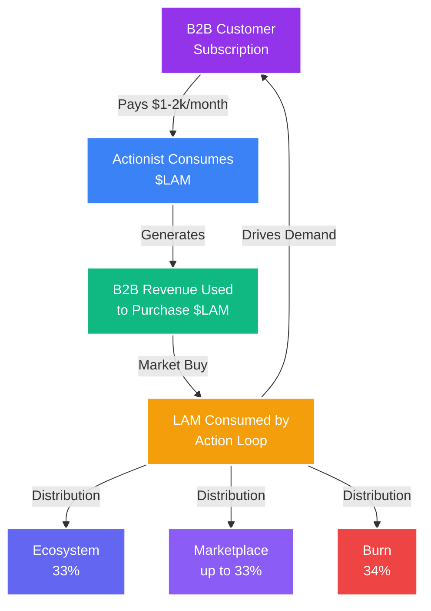

<Note>

**The Perfect Economic Storm**: $LAM combines the deflationary power of burning, the growth velocity of network effects, and the value creation of real B2B revenue. This isn't speculation—it's an economic revolution backed by actual utility.

</Note>

## The $LAM Economic Model

### A New Paradigm for AI Ownership

The $LAM token represents more than cryptocurrency—it's the foundation of a new economic system where AI value flows to the community that creates it, not corporate shareholders. Every aspect is designed to create sustainable, long-term value appreciation.

<CardGroup cols={3}>
<Card title="Deflationary by Design" icon="fire">

34% of every token used is burned forever, creating permanent scarcity

</Card>

<Card title="Revenue-Backed" icon="building">

B2B subscriptions create continuous buy pressure through the buyback mechanism

</Card>

<Card title="Community-Driven" icon="users">

35% of supply distributed to trainers, creators, and network builders

</Card>
</CardGroup>

## Token Distribution

### Initial Supply Allocation

<Frame caption="Token Distribution - Building a Sustainable Ecosystem">
  
</Frame>

### Total Supply: 1,000,000,000 $LAM

<Tabs>
<Tab title="Community (35%)" icon="users">

### 350,000,000 tokens

**Distribution Schedule**:
- 4-year vesting period
- Daily distributions based on contributions
- No cliff, immediate earning starts

**Allocation Breakdown**:
- Training rewards: 200M (20%)
- Referral bonuses: 75M (7.5%)
- Creator incentives: 50M (5%)
- Community treasury: 25M (2.5%)

**Why This Matters**: Largest allocation ensures community ownership

</Tab>
<Tab title="Team &amp; Advisors (20%)" icon="user-tie">

### 200,000,000 tokens

**Vesting Schedule**:
- 1-year cliff
- 3-year linear vesting after cliff
- Performance-based unlocks

**Breakdown**:
- Core team: 150M (15%)
- Advisors: 30M (3%)
- Future hires: 20M (2%)

**Alignment**: Long vesting ensures team commitment

</Tab>
<Tab title="Ecosystem Fund (15%)" icon="seedling">

### 150,000,000 tokens

**Purpose**:
- Partnership incentives
- Developer grants
- Marketing campaigns
- Strategic initiatives

**Release**: DAO-governed, proposal-based

</Tab>
<Tab title="Private Sale (15%)" icon="lock">

### 150,000,000 tokens

**Terms**:
- 6-month cliff
- 18-month linear vesting
- Strategic investors only

**Use of Funds**:
- Development: 40%
- Marketing: 30%
- Operations: 20%
- Legal/Compliance: 10%

</Tab>
<Tab title="Public Sale (10%)" icon="globe">

### 100,000,000 tokens

**Structure**:
- Fair launch mechanism
- No VCs get preferential pricing
- Community-first approach

**Pricing**: Determined by market demand

</Tab>
<Tab title="Liquidity (5%)" icon="water">

### 50,000,000 tokens

**Purpose**:
- DEX liquidity pools
- CEX market making
- Price stability
- Trading depth

**Management**: Professional market makers

</Tab>
</Tabs>

## The Deflationary Engine

### How Scarcity Drives Value

<Warning>

**Mathematical Certainty**: With 34% of tokens burned on every action and billions of daily actions projected, the supply will decrease dramatically. This isn't hope—it's math.

</Warning>

### Burn Mechanics

<Steps>
<Step title="Action Execution">

User or business executes an AI action that consumes tokens based on current pricing

</Step>

<Step title="Token Consumption">

Tokens are deducted from user's balance at market-determined rate

</Step>

<Step title="Immediate Burn">

34% of consumed tokens sent to burn address (0x000...dead)

</Step>

<Step title="Supply Reduction">

Total supply permanently decreased, visible on-chain

</Step>

<Step title="Scarcity Increase">

Remaining tokens become more scarce, supporting price appreciation

</Step>
</Steps>

## Revenue Cycle

### The B2B Buyback Loop

### How Revenue Creates Value

<AccordionGroup>
<Accordion title="Step 1: Enterprise Subscriptions">

**B2B SaaS Model**:
- Enterprises pay $1,000-2,000/month per AI agent
- Payment in fiat for predictable budgeting
- Unlimited actions within tier
- 24/7 cloud VM operation

**Market Size**:
- Target: 100,000 enterprises by 2027
- Average: 5 agents per enterprise
- Potential: $500M-1B annual revenue

</Accordion>

<Accordion title="Step 2: Token Buyback">

**Automatic Market Operations**:
- 80% of revenue allocated to buyback
- Daily market purchases
- Multiple DEX/CEX execution
- Price-supportive buying

**Impact**:
- Continuous buy pressure
- Price floor support
- Reduced circulating supply
- Positive price momentum

</Accordion>

<Accordion title="Step 3: Agent Operations">

**Token Consumption**:
- Agents perform thousands of daily actions
- Each action consumes tokens at market rate
- Consumption scales with usage
- Creates natural demand

**Usage Metrics**:
- Average agent: 5,000 actions/day
- 500,000 agents = 2.5B daily actions
- Massive token velocity

</Accordion>

<Accordion title="Step 4: Distribution &amp; Burn">

**Value Flow**:
- 34% burned (deflationary pressure)
- Up to 33% to creators (incentive alignment based on Creator Epoch)
- 33% to foundation (sustainability)

**Compound Effects**:
- Burning reduces supply
- Creator rewards drive quality
- Foundation funding ensures growth

</Accordion>
</AccordionGroup>

## Economic Incentives

### Aligning All Stakeholders

<Tabs>
<Tab title="Users/Trainers" icon="user">

### Why Users Participate

**Immediate Benefits**:
- Earn tokens for browsing normally
- Passive income from referrals
- Early access to AI automation
- Ownership in the platform

**Long-term Value**:
- Token appreciation potential
- Governance rights
- Revenue sharing eligibility
- Network effects compound

</Tab>
<Tab title="Creators" icon="hammer">

### Why Creators Build

**Direct Monetization**:
- 33% of all usage revenue
- Passive income from workflows
- No platform fees
- Instant payments

**Growth Opportunities**:
- Global marketplace access
- Marketing support
- Technical resources
- Community promotion

</Tab>
<Tab title="Enterprises" icon="building">

### Why Businesses Buy

**Operational Benefits**:
- 90% cost reduction vs human labor
- 24/7 operation without breaks
- Perfect accuracy and consistency
- Instant scalability

**Financial Advantages**:
- Predictable subscription costs
- 10% discount paying in $LAM
- No HR overhead
- Immediate ROI

</Tab>
<Tab title="Investors" icon="chart-line">

### Why Investors Hold

**Value Drivers**:
- Deflationary tokenomics
- Real revenue generation
- Network effects
- First-mover advantage

**Risk Mitigation**:
- Utility-backed value
- Diverse revenue streams
- Community ownership
- Regulatory compliance

</Tab>
</Tabs>

## Velocity and Circulation

### Token Flow Dynamics

<Info>

**High Velocity, Low Float**: Tokens constantly circulate through the economy—earned, spent, burned, and re-earned. This creates healthy velocity while burning reduces float.

</Info>

### Circulation Patterns

<CardGroup cols={2}>
<Card title="Earning Flows" icon="arrow-down">

**Tokens Enter Circulation**:
- Training rewards distributed
- Referral commissions paid
- Creator earnings credited
- Staking rewards released

Daily Distribution: ~1M tokens

</Card>

<Card title="Burning Flows" icon="arrow-up">

**Tokens Exit Circulation**:
- Action execution burns
- Voluntary burning events
- Failed transaction burns
- Penalty burns

Daily Burn: 3-170M tokens (scaling)

</Card>

<Card title="Trading Flows" icon="arrows-rotate">

**Secondary Market**:
- DEX swaps
- CEX trading
- P2P transfers
- Liquidity provision

Daily Volume: $10-100M (projected)

</Card>

<Card title="Utility Flows" icon="gear">

**Platform Usage**:
- API consumption
- Subscription payments
- Marketplace purchases
- Premium features

Daily Utility: 10M+ actions

</Card>
</CardGroup>

## Price Discovery Mechanism

### How Value Is Determined

<Note>

**Market-Driven Pricing**: Unlike stablecoins or pegged assets, $LAM price floats freely based on supply, demand, and utility value. This allows for appreciation as the platform grows.

</Note>

### Price Factors

| Factor | Impact | Direction | Magnitude |
|--------|--------|-----------|-----------|
| **Token Burns** | Reduces supply | ⬆️ Positive | High |
| **B2B Revenue** | Creates buy pressure | ⬆️ Positive | High |
| **User Growth** | Increases demand | ⬆️ Positive | Medium |
| **Creator Activity** | Enhances utility | ⬆️ Positive | Medium |
| **Market Sentiment** | Affects trading | ↕️ Variable | Variable |
| **Competition** | Market share impact | ⬇️ Negative | Low |

## Sustainability Model

### Long-Term Economic Viability

<Steps>
<Step title="Revenue Diversification">

Multiple revenue streams ensure sustainability:
- B2B subscriptions (primary)
- API usage fees
- Marketplace commissions
- Premium features
- Enterprise services

</Step>

<Step title="Cost Optimization">

Efficient operations maintain profitability:
- Automated systems
- Community-driven development
- Decentralized infrastructure
- Minimal overhead

</Step>

<Step title="Treasury Management">

Strategic reserves ensure longevity:
- Operating reserves
- Development fund
- Emergency fund
- Growth capital

</Step>

<Step title="Governance Evolution">

DAO structure enables adaptation:
- Community proposals
- Token holder voting
- Parameter adjustments
- Strategic pivots

</Step>
</Steps>

## Market Opportunities

### Capturing Value Across Multiple Revenue Streams

Action Model is positioned to capture value across multiple trillion-dollar markets through diversified revenue streams:

- **Data Licensing**: Proprietary LAM training data from millions of users
- **B2B SaaS**: Enterprise automation agents at $1-2K/month
- **API Platform**: Developer ecosystem generating billions of API calls
- **Marketplace**: Commission on workflow and agent sales
- **Infrastructure**: DePIN network, distributed computing, proxy services
- **Professional Services**: Implementation, consulting, and training
- **Automated Testing**: QA automation for dev teams pushing software updates
- **Industry Verticals**: Call centers, financial services, healthcare, e-commerce

Each revenue stream drives $LAM demand through the buyback-and-burn mechanism, creating compound value appreciation.

<Card title="Explore Full Market Analysis" icon="chart-line" href="/tokenomics/market-opportunities" color="#9333ea">

Discover the trillion-dollar opportunity landscape and how Action Model captures value at every layer

</Card>

## Join the Economic Revolution

<CardGroup cols={2}>
<Card title="Start Earning" icon="coins" href="/tokenomics/point-tiers-and-epochs" color="#9333ea">

Begin training and earning your stake in the AI economy

</Card>

<Card title="Become a Creator" icon="hammer" href="/tokenomics/marketplace-distributions" color="#3b82f6">

Build workflows and earn from every usage

</Card>
</CardGroup>

---

**This isn't just tokenomics. It's the blueprint for economic revolution.**

**Where AI value flows to those who create it. Where usage drives scarcity. Where community owns the future.**

**The economy is being rewritten. Will you own a piece?**