<Info>

**LAM is Action Fuel**: Unlike speculative tokens, LAM has real utility—every click, type, and navigation performed by AI agents consumes $LAM. This isn't a currency; it's the gasoline that powers the automation economy.

</Info>

## The $LAM Token: Powering the Action Economy

### More Than a Token—It's Ownership

LAM represents a fundamental shift in how AI value is created and distributed. When Big Tech's AI performs actions, they keep 100% of the value. When Action Model's AI performs actions, the value flows back to the community through $LAM.

<CardGroup cols={3}>
<Card title="Action Fuel" icon="gas-pump" href="#how-lam-powers-every-action">

Every agent click, type, scroll, upload, or form submit consumes $LAM as fuel

</Card>

<Card title="DAO Governance" icon="landmark" href="/the-action-model/action-model-is-the-uprising">

Decentralized Autonomous Organization - Action Model is the Uprising

</Card>

<Card title="Marketplace" icon="store" href="/marketplace/marketplace-overview">

Earn from your workflows and agents in the creator economy

</Card>

<Card title="Train the LAM" icon="brain" href="/the-large-action-model-lam/training-the-large-action-model">

Contributors help train the Large Action Model and earn rewards

</Card>

<Card title="Action Credits" icon="coins" href="#token-utility-ecosystem">

Partners and devs preload $LAM to fund fleets of agents

</Card>

<Card title="Referrals & Quests" icon="users" href="/tokenomics/referrals-and-affiliates">

Build your network through referrals, affiliates, and quest rewards

</Card>
</CardGroup>

## $LAM Token Overview

<Note>

**LAM is Action Fuel:** Every GUI action executed by a LAM agent consumes $LAM.

</Note>

<CardGroup cols={2}>
<Card title="Dynamic Pricing Model" icon="calculator">

**Price-in-USD per action is fixed** by LAM version (e.g., LAM-1 = $0.01/action), while the number of tokens per action floats with the token price.

</Card>

<Card title="Token Distribution" icon="chart-pie">

Each consumed action distributes tokens: **34% Burn**, **33% Marketplace Distribution**, **33% Action Model Foundation** (foundation ops, rewards, R&amp;D).

</Card>

<Card title="Buy Pressure Engine" icon="arrow-trend-up">

**B2B + Partners create continuous buy pressure.** Subscriptions and API usage require $LAM purchases to fund actions. Paying subscriptions directly in LAM grants a 10% discount.

</Card>

<Card title="Deflationary Dynamics" icon="fire">

**Because a share of every action is burned**, higher usage permanently reduces supply; the rest recirculates to creators/foundation to grow the ecosystem.

</Card>
</CardGroup>

## How $LAM Powers Every Action

### The Action Loop

<Frame caption="The Action Loop - How Each AI Decision Consumes $LAM">
  
</Frame>

<Steps>
<Step title="Environment Input">

The LAM receives the current state: screenshot, DOM, user goal, and action history

</Step>

<Step title="Tree Search">

The AI searches the Action Tree to find the optimal next action

</Step>

<Step title="Action Decision">

The LAM determines the precise GUI action to execute

</Step>

<Step title="$LAM Consumption">

This single action consumes $LAM tokens based on the current pricing model

</Step>

<Step title="Action Execution">

The action is performed (click, type, navigate, etc.)

</Step>

<Step title="Loop Continues">

Process repeats until the goal is achieved or time expires

</Step>
</Steps>

<Warning>

**Every Iteration = Billable Action**: Each loop through this process is one action that consumes $LAM. A complex workflow might require 100+ actions, creating continuous token demand.

</Warning>

## Token Economics Model

### Fixed USD Pricing, Floating Token Cost

<Info>

**Price Stability for Businesses**: The USD cost per action is fixed by LAM version (e.g., LAM-1 = $0.01/action), while the number of tokens consumed adjusts with market price. This gives businesses predictable costs while allowing token value to appreciate.

</Info>

### Pricing Formula

<Tabs>
<Tab title="Basic Formula" icon="calculator">

For LAM version `v` with USD price per action `pv`:

**Tokens Required Per Action:**
```
τ(v,t) = pv / Pt
```

Where:
- `τ(v,t)` = Tokens required per action at time t
- `pv` = USD price per action for version v
- `Pt` = Market price of $LAM in USD at time t

</Tab>
<Tab title="Examples" icon="chart-bar">

### LAM-1 Examples (p1 = $0.01/action)

| Token Price | Tokens Per Action | 1000 Actions Cost |
|-------------|-------------------|-------------------|
| $0.001 | 10 tokens | 10,000 tokens |
| $0.01 | 1 token | 1,000 tokens |
| $0.10 | 0.1 tokens | 100 tokens |
| $1.00 | 0.01 tokens | 10 tokens |

**Key Insight**: As token price increases, fewer tokens are needed per action, benefiting early holders.

</Tab>
</Tabs>

## Token Distribution Per Action

### Where Every $LAM Goes

<Frame caption="Token Distribution - Creating Value Through Every Action">
  
</Frame>

When an action consumes tokens, they are distributed as follows:

<CardGroup cols={3}>
<Card title="34% Burned" icon="fire" color="#ef4444">

**Deflationary Mechanism**

Permanently removed from circulation, increasing scarcity with every action

</Card>

<Card title="33% to Creators" icon="user-plus" color="#10b981">

**Marketplace Rewards**

Goes to workflow creators when their automations are used

</Card>

<Card title="33% to Foundation" icon="building" color="#3b82f6">

**Ecosystem Growth**

Funds development, operations, rewards, and community initiatives

</Card>
</CardGroup>

### Distribution Mathematics

For each action consuming `τ` tokens:
- **Burned**: `0.34 × τ` tokens
- **Creator**: `0.33 × τ` tokens (if marketplace workflow)
- **Foundation**: `0.33 × τ` tokens

## The B2B Buyback Loop

### How Business Demand Drives Token Value

<Steps>
<Step title="Business Subscribes">

Enterprise pays $1,000-2,000/month per AI agent

</Step>

<Step title="Platform Buys $LAM">

Subscription revenue used to purchase $LAM from market

</Step>

<Step title="Agents Consume Tokens">

AI agents perform actions, consuming $LAM as fuel

</Step>

<Step title="Tokens Distributed">

34% burned, 33% to creators, 33% to foundation

</Step>

<Step title="Supply Decreases">

Burning reduces total supply permanently

</Step>

<Step title="Value Appreciates">

Decreased supply + continued demand = price appreciation

</Step>
</Steps>

### The Virtuous Cycle

```mermaid
flowchart TB
    subgraph cycle [" "]
        A(More Business<br/>Usage 🏢)
        B(More Token<br/>Demand 💰)
        C(More<br/>Burning 🔥)
        D(Higher Token<br/>Value 📈)
        E(More Creator<br/>Incentive 💡)
        F(Better<br/>Workflows ⚡)
    end
    
    A --> B
    B --> C
    C --> D
    D --> E
    E --> F
    F --> A
    
    style A fill:#9333ea,stroke:#fff,stroke-width:3px,color:#fff,font-weight:bold
    style B fill:#a855f7,stroke:#fff,stroke-width:3px,color:#fff,font-weight:bold
    style C fill:#ef4444,stroke:#fff,stroke-width:3px,color:#fff,font-weight:bold
    style D fill:#10b981,stroke:#fff,stroke-width:3px,color:#fff,font-weight:bold
    style E fill:#3b82f6,stroke:#fff,stroke-width:3px,color:#fff,font-weight:bold
    style F fill:#f59e0b,stroke:#fff,stroke-width:3px,color:#fff,font-weight:bold
    style cycle fill:none,stroke:#9333ea,stroke-width:2px,stroke-dasharray: 5 5
```



<Info>

**Self-Reinforcing Economics**: Each step in the cycle strengthens the next, creating exponential growth. More usage leads to more burning, which increases scarcity, driving up value, attracting more creators, who build better automations, which attracts more businesses.

</Info>

## Token Utility Ecosystem

### Multiple Demand Drivers

<Tabs>
<Tab title="Action Credits" icon="bolt">

### Direct API Usage

**Developers and Partners**
- Pre-load $LAM for API calls
- Each API action consumes tokens
- Usage-based pricing model
- No subscription required

**Consumption Rate**
- Average workflow: 50-200 actions
- Complex automation: 500+ actions
- Daily agent operations: 10,000+ actions

</Tab>
<Tab title="Marketplace" icon="store">

### Creator Economy

**Workflow Publishing**
- Creators earn 33% of tokens consumed
- Passive income from popular workflows
- Incentive for quality automation

**Success Examples**
- Top workflow: 1M+ monthly executions
- Creator earnings: $3,000+/month
- No maintenance required

</Tab>
<Tab title="Governance" icon="balance-scale">

### DAO Participation

**Voting Power**
- Propose platform changes
- Influence development priorities

**Staking Benefits**
- Enhanced voting weight
- Priority feature access
- Revenue sharing participation

</Tab>
<Tab title="Training Rewards" icon="graduation-cap">

### Earn by Contributing

**Data Contribution**
- Browser extension training
- Active workflow labeling
- Platform bounties
- Referral rewards

**Token Allocation**
- 35% of total supply for community
- Distributed over 4 years
- Merit-based allocation

</Tab>
</Tabs>

## Subscription Discount Model

### Pay with $LAM, Save 10%

Businesses can pay subscriptions directly in $LAM tokens for a 10% discount:

<Info>

**Example**: $1,000 monthly subscription
- Pay in USD: $1,000
- Pay in $LAM: $900 worth of tokens

This incentivizes businesses to hold and use $LAM, creating additional buy pressure.

</Info>

### Discount Formula

```
Tokens Required = S × (1 - d) / Pt
```

Where:
- S = Subscription amount in USD
- d = Discount rate (0.10 for 10%)
- Pt = Current token price

## Deflationary Dynamics

### Why $LAM Becomes More Valuable Over Time

<CardGroup cols={2}>
<Card title="Continuous Burning" icon="fire">

**34% of Every Action**
- Millions of daily actions
- Permanent supply reduction
- Accelerates with adoption
- Cannot be reversed

</Card>

<Card title="Growing Demand" icon="chart-line">

**Multiple Demand Sources**
- B2B subscriptions
- API usage
- Marketplace activity
- Speculation and holding

</Card>
</CardGroup>


## Real-World Usage Examples

### Understanding Token Consumption

<AccordionGroup>
<Accordion title="Simple Email Automation">

**Task:** Check Gmail, summarize important emails, create daily digest<br/>
<br/>
**Actions Required:** ~50

- Login: 5 actions
- Navigate inbox: 10 actions
- Read emails: 20 actions
- Create summary: 10 actions
- Send digest: 5 actions

<br/>

**AI Agent Cost** (at $0.01 token price): 50 tokens = $0.50<br/>
<br/>
**Human Cost** (15 minutes @ $30/hour): $7.50<br/>
<br/>
**Savings:** 93% cost reduction

</Accordion>

<Accordion title="Social Media Management">

**Task:** Post content across LinkedIn, Twitter, Instagram<br/>
<br/>
**Actions Required:** ~150

- Content preparation: 20 actions
- LinkedIn posting: 40 actions
- Twitter posting: 40 actions
- Instagram posting: 50 actions

<br/>

**AI Agent Cost** (at $0.01 token price): 150 tokens = $1.50<br/>
<br/>
**Human Cost** (45 minutes @ $30/hour): $22.50<br/>
<br/>
**Savings:** 93% cost reduction

</Accordion>

<Accordion title="Enterprise Data Processing">

**Task:** Extract data from 100 invoices, update CRM, generate report<br/>
<br/>
**Actions Required:** ~2,000

- Invoice processing: 1,500 actions
- CRM updates: 300 actions
- Report generation: 200 actions

<br/>

**AI Agent Cost** (at $0.01 token price): 2,000 tokens = $20.00<br/>
<br/>
**Human Cost** (8 hours @ $30/hour): $240.00<br/>
<br/>
**Savings:** 92% cost reduction

</Accordion>
</AccordionGroup>

## Formal Tokenomics Model

### Mathematical Framework

### Pricing Model (Versioned "Price Per Action")

- Let `pᵥ` be the **USD price per action** for model version `v` (e.g., LAM-1 has `p₁ = $0.10` per action)
- Let `Pₜ` be the **market price of $LAM in USD** at time `t`
- **Tokens required per action** for version `v` at time `t` is:

<Info>

**Formula:**
```
τᵥ,ₜ = pᵥ / Pₜ
```

</Info>

**Fractional tokens** are supported to meter actions precisely.

#### Examples (LAM-1):
- If `Pₜ = $0.01`, then `τ₁,ₜ = 0.10 / 0.01 = 10 tokens/action`
- If `Pₜ = $0.10`, then `τ₁,ₜ = 1 token/action`
- If `Pₜ = $1.00`, then `τ₁,ₜ = 0.1 token/action`

**USD cost per action is stable for developers; tokens per action adjusts automatically to market price.**

---

### Token Fuel Distribution (Per Action)

Let the distribution shares be:
- **Burn share** `β = 0.34`
- **Marketplace creator share** `μ = 0.33`
- **Foundation share** `φ = 0.33`

For one action that consumes `τ` tokens:

```
Burned tokens/action = β · τ
Creator tokens/action = μ · τ    (if a Marketplace workflow was used)
Foundation tokens/action = φ · τ
```

#### USD Equivalents Per Action:

<CardGroup cols={3}>
<Card>

**USD burned/action = β · pᵥ**

</Card>
<Card>

**USD to creator/action = μ · pᵥ**

</Card>
<Card>

**USD to foundation/action = φ · pᵥ**

</Card>
</CardGroup>

For LAM-1 (`p₁ = $0.10`): **$0.034** is burned, **$0.033** goes to the creator (if used), and **$0.033** to the foundation **per action**, independent of token price.

<Note>

**No-Marketplace case**: If a run doesn't use a Marketplace workflow, the creator share can be (a) retained in an **Ecosystem Rewards** pool or (b) redirected to the **Foundation**. The DAO should ratify the default.

</Note>

---

### The Buyback Loop (Why Usage Creates Demand)

- **B2B subscriptions** (e.g., $1k–$2k per agent/month) and **API partners** include usage allowances measured in actions
- To deliver those actions, **operators must acquire $LAM** (buy on the market or hold inventory)
- When actions run, tokens flow through the **Fuel distribution** above (with 34% burned)

#### Paying Subscriptions in $LAM (10% Discount)

- Paying a $1,000 subscription in $LAM yields a **10% discount**: you spend tokens equivalent to **$900** at the time of payment
- Those tokens may be escrowed and released into the Fuel distribution as actions are consumed (implementation detail—DAO parameter)

**Tokens needed to pay a subscription `S` in USD with a discount `d`:**

<Info>

**Formula:**
```
Tokens = S(1 - d) / Pₜ
```

</Info>

---

### Advanced Tokenomics Calculations

#### Per-Action Accounting (LAM-v)

- **Tokens per action:** `τᵥ,ₜ = pᵥ / Pₜ`
- **Burn:** `Bₐcₜ = βτᵥ,ₜ`
- **Creator:** `Mₐcₜ = μτᵥ,ₜ · 𝟙marketplace`
- **Foundation:** `Fₐcₜ = φτᵥ,ₜ`

#### Network-Level, Period t (e.g., monthly)

Let `Aₜ` be actions executed in `t`. Then:

```
Tokens needed    Dₜ = τᵥ,ₜ · Aₜ
Burned tokens    Bₜ = β · Dₜ
Creator tokens   Mₜ = μ · Dₜ · Pr(marketplace use)
Foundation tokens Fₜ = φ · Dₜ
USD spent on actions Uₜ = pᵥ · Aₜ    (price-invariant)
```

#### Supply Dynamics

Let `Sₜ` be circulating supply at start of `t`. Let `Eₜ` be new emissions (training rewards, grants) approved by DAO.

<Info>

**Supply Evolution:**
```
Sₜ₊₁ = Sₜ + Eₜ - Bₜ
```

</Info>

**Conditions:**
- **Deflationary condition:** `Bₜ > Eₜ`
- **Neutral:** `Bₜ = Eₜ`
- **Inflationary:** `Bₜ < Eₜ`

**Break-even emissions (deflation-neutral):**

<Info>

**Formula:**
```
E*ₜ = β · τᵥ,ₜ · Aₜ
```

</Info>

#### "Half-Life" Under Constant Burn and No Emissions (Illustrative)

If actions are steady and `Eₜ = 0`, supply declines linearly. Time to reduce supply by half:

<Info>

**Half-Life Formula:**
```
T₁/₂ = S₀ / (2 · Bₜ) = S₀ / (2 · β · τᵥ,ₜ · Aₜ)
```

</Info>

## Token Training Distribution

### Rewarding Data Contributors

<Info>

**Future Enhancement**: A portion of consumed $LAM may be distributed to trainers who provided the action branches/trees used in executed workflows.

</Info>

<CardGroup cols={2}>
<Card title="How It Works" icon="share-nodes">

When users train the LAM by demonstrating actions (e.g., creating an AWS EC2 instance), they contribute to the Action Tree. When workflows use these trained paths, contributors earn rewards.

**Example Flow:**
1. 1,000 users train "Create EC2 Instance" action
2. Enterprise workflow uses this action path
3. Training distribution portion flows to those 1,000 trainers
4. Rewards proportional to contribution quality

</Card>

<Card title="Incentive Alignment" icon="handshake">

**Benefits:**
- Rewards quality training data
- Incentivizes rare/complex actions
- Creates passive income for trainers
- Improves model accuracy

**Distribution Formula:**
```
Trainer Reward = (Quality Score × Usage Count) / Total Contributors
```

</Card>
</CardGroup>

## Action Model API (Developers)

### Building with the Large Action Model

<Warning>

Unlike LLMs that output text, the LAM outputs **actions**. Each API call returns the next GUI action to execute, not generated content.

</Warning>

<Tabs>
<Tab title="LAM vs LLM APIs" icon="code-compare">

### Fundamental Differences

| Aspect | OpenAI API (LLM) | Action Model API (LAM) |
|--------|------------------|------------------------|
| **Input** | Text prompt | Environment state + goal |
| **Output** | Generated text | Next action to execute |
| **Pricing Unit** | Input/output tokens | Actions performed |
| **Use Case** | Content generation | Task automation |
| **Billing** | Per token | Per action |

</Tab>
<Tab title="OpenAI API Example" icon="robot">

### Traditional LLM Flow

**Request:**
```json
{
  "prompt": "Write me a blog post about coffee",
  "tokens": 7
}
```

**Response:**
```json
{
  "text": "The best coffee in the world is...",
  "tokens": 1000
}
```

**Pricing (GPT-4):**
- Input: $2/1M tokens
- Output: $8/1M tokens
- Total cost: Based on combined token count

</Tab>
<Tab title="Action Model API" icon="mouse-pointer">

### LAM API Flow

**Request (Environment State):**
```json
{
  "goal": "Configure an AWS EC2 instance",
  "history": ["logged_in", "dashboard_open"],
  "screenshot": "base64_image",
  "html": "<full_page_source>",
  "dom_elements": ["button#create", "input#name"],
  "context": {
    "instance_type": "t2.micro",
    "region": "us-east-1"
  }
}
```

**Response (Next Action):**
```json
{
  "action": "click",
  "target": "button#create-instance",
  "coordinates": {"x": 450, "y": 320},
  "confidence": 0.98,
  "tokens_consumed": 0.1
}
```

**Pricing:**
- LAM-1: $0.01 per action
- No separate input/output costs
- Predictable automation expenses

</Tab>
<Tab title="Integration Guide" icon="plug">

### Quick Start

**1. Initialize Client:**
```javascript
const LAM = require('@actionmodel/lam-sdk');
const client = new LAM({
  apiKey: 'your-api-key',
  preloadTokens: 1000 // Pre-purchase $LAM
});
```

**2. Execute Workflow:**
```javascript
const result = await client.executeWorkflow({
  workflowId: 'aws-ec2-setup',
  parameters: {
    instanceType: 't2.micro',
    securityGroup: 'web-servers'
  }
});
```

**3. Monitor Usage:**
```javascript
console.log(`Actions used: ${result.actionsConsumed}`);
console.log(`Tokens spent: ${result.tokensUsed}`);
console.log(`USD cost: $${result.usdCost}`);
```

</Tab>
</Tabs>

## Long-Term Economic Benefits

### Why $LAM Creates Sustainable Value

<CardGroup cols={2}>
<Card title="Price-Stable UX" icon="shield-halved">

**Predictable Costs for Business**

Customers think in actions and USD, not token volatility. The floating token model ensures:
- Fixed USD cost per action
- No surprise bills from price swings
- Easy budgeting for enterprises
- Seamless B2B adoption

</Card>

<Card title="Automatic Market Clearing" icon="scale-balanced">

**Counter-Cyclical Demand**

As $LAM price changes, token consumption auto-adjusts:
- Price rises → Fewer tokens needed per action
- Price falls → More tokens needed per action
- USD revenue remains stable
- Natural price discovery mechanism

</Card>

<Card title="Permanent Scarcity Creation" icon="fire-flame-curved">

**Usage = Value**

Every action permanently removes supply:
- 34% burn rate compounds over time
- Millions of daily actions = massive burns
- Supply decreases while demand grows
- Mathematical path to appreciation

</Card>

<Card title="Creator Alignment" icon="hand-holding-dollar">

**Earn Real Value, Not Speculation**

Creators receive cash-equivalent rewards:
- 33% of action value in any market
- Income tied to usage, not price
- Incentivizes quality over hype
- Sustainable creator economy

</Card>
</CardGroup>

### The Compound Effect

<Info>

**Mathematical Certainty**: With growing usage and constant burn rate, the following becomes inevitable:

1. **Year 1**: 10M daily actions → 3.4M tokens burned daily
2. **Year 2**: 100M daily actions → 34M tokens burned daily
3. **Year 3**: 500M daily actions → 170M tokens burned daily
4. **Year 5**: 2B daily actions → 680M tokens burned daily

At scale, daily burns exceed total initial supply, creating extreme scarcity.

</Info>

## Why $LAM is Different

### Comparing Token Models

| Feature | $LAM | Traditional Tokens | Meme Coins |
|---------|------|-------------------|------------|
| **Utility** | Powers every AI action | Often minimal | None |
| **Demand Driver** | B2B usage + API calls | Speculation | Hype only |
| **Supply Mechanism** | Deflationary (burning) | Usually inflationary | Fixed/Inflationary |
| **Revenue Model** | Real business revenue | Token trading only | None |
| **Value Backing** | Automation demand | Project promises | Community sentiment |

## Getting Started with $LAM

<CardGroup cols={3}>
<Card title="Earn Tokens" icon="coins" href="/tokenomics/point-tiers-and-epochs" color="#9333ea">

Start training the LAM and earning your first tokens

</Card>

<Card title="Use Tokens" icon="play" href="/actionist/actionist-overview" color="#3b82f6">

Deploy AI agents that consume $LAM to automate tasks

</Card>

<Card title="Create Workflows" icon="hammer" href="/marketplace/marketplace-overview" color="#10b981">

Build automations and earn from every usage

</Card>
</CardGroup>

---

**$LAM isn't just a token. It's the fuel for the automation revolution.**

**Every action builds value. Every burn increases scarcity. Every holder owns the future.**